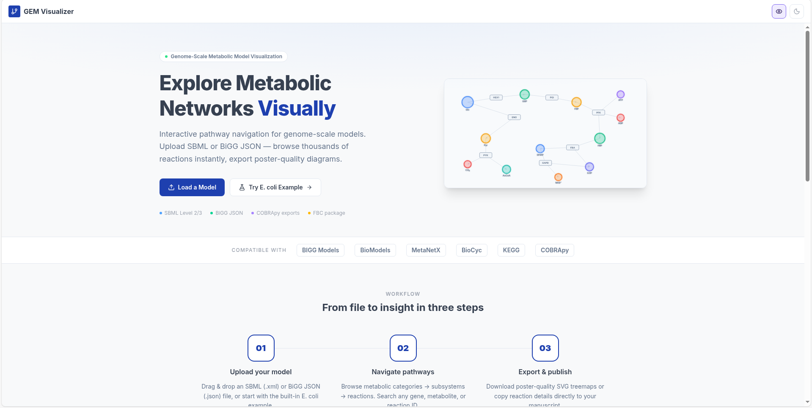
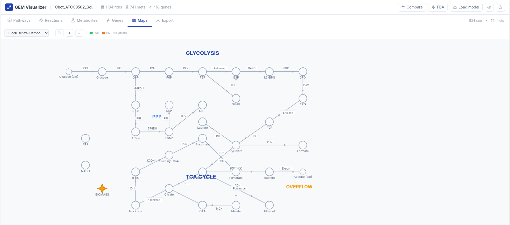

<div align="center">



# MetaboViz

**The browser-native Genome-Scale Metabolic Model explorer — zero install, full analysis**

[](LICENSE)
[](https://react.dev)
[](https://vitejs.dev)
[](https://github.com/jvail/glpk.js)
[](CONTRIBUTING.md)

[**Live Demo**](https://tamoghna12.github.io/metaboviz) · [**Quick Start**](#quick-start) · [**Features**](#features) · [**Usage Guide**](docs/USAGE.md) · [**Contributing**](CONTRIBUTING.md)

</div>

---

## Why MetaboViz?

Every existing GEM tool forces a painful tradeoff:

| Tool | Install required | FBA built-in | Pathway maps | Gene KO sim | Model diff | Genome-scale (>1k rxns) |
|------|:-:|:-:|:-:|:-:|:-:|:-:|
| **MetaboViz** | ✅ No | ✅ Yes | ✅ Yes | ✅ Yes | ✅ Yes | ✅ Yes |
| Escher web | ✅ No | ❌ No | ✅ Yes | ❌ No | ❌ No | ❌ No |
| COBRApy | ❌ Python | ✅ Yes | ❌ No | ✅ Yes | ❌ No | ✅ Yes |
| BiGG Browser | ✅ No | ❌ No | ❌ No | ❌ No | ❌ No | ✅ Yes |
| VANTED | ❌ Java | ✅ Yes | ✅ Yes | ❌ No | ❌ No | ⚠️ Slow |
| OptFlux | ❌ Java | ✅ Yes | ⚠️ Basic | ✅ Yes | ❌ No | ⚠️ Slow |

MetaboViz is the **only tool that runs entirely in a browser tab** and combines:
- Real LP-based FBA (GLPK.js + HiGHS WASM solvers)
- Escher-style curated pathway maps with live flux overlay
- Gene knockout phenotype simulator with WT vs KO comparison
- Side-by-side comparative model diff for two GEMs
- Hierarchical subsystem browser built for genome-scale (1 000–13 000 reaction) models

No Python. No Java. No server. Open the URL, drag in a model, start analysing.

---

## Features

### 1 — Hierarchical Pathway Browser

Navigate thousands of reactions without the "hairball" problem. Subsystems are grouped into biological categories; click any block to drill down.


- **9 top-level categories** (Amino Acid, Lipid, Transport, etc.) auto-classified from BiGG/KEGG nomenclature
- **Treemap view** for instant visual sizing of each pathway
- **Reaction table** with full stoichiometry, reversibility badge, flux bounds, and GPR rule
- **Global search** across reactions, metabolites, and genes simultaneously


---

### 2 — Escher-style Pathway Maps

Curated metabolic maps with smooth bezier curves, reaction-node dots, and live flux/phenotype overlay.



- **4 built-in templates**: E. coli Central Carbon, Glycolysis, TCA Cycle, Pentose Phosphate
- **Live BiGG fetch**: load any Escher map directly from `escher.github.io` (E. coli core, iJO1366, iMM904, …)
- **Import your own** Escher JSON map — full cubic-bezier routing preserved
- **Flux overlay**: edges turn green (forward), orange (reverse), grey (blocked); width scales with |flux|
- **Phenotype overlay**: red = lost flux, purple = gained, orange = reduced, green = unchanged after gene KO

---

### 3 — FBA + Gene Knockout Phenotype Simulator

Run Flux Balance Analysis in the browser with one click. Knock out genes, see which reactions lose flux.

```
Objective:   max  c · v
Subject to:  S · v = 0     (steady-state)
             lb ≤ v ≤ ub   (bounds)
             v_j = 0  ∀j blocked by gene KO (GPR evaluation)
```

- Set exchange constraints (glucose uptake, O₂, etc.)
- Toggle any gene off — GPR boolean (AND/OR) correctly propagated to blocked reactions
- **WT vs KO comparison**: runs both solves in parallel, reports Δμ and per-reaction status
- Flux results overlaid on network canvas AND pathway map simultaneously

---

### 4 — Comparative Model Viewer

Load two GEMs side by side and instantly see what differs.

- **Reaction diff table**: A-only, B-only, shared — sortable and searchable
- **Subsystem overlap bar**: stacked bar showing A-only | shared | B-only reaction counts
- **Sørensen-Dice overlap score** for quantitative similarity
- **Gene set diff**: unique and shared genes across both models
- Supports any two SBML or BiGG JSON files

---

### 5 — Network Canvas

Force-directed metabolic network with Cytoscape.js — flux and phenotype colour-coded.

- Bipartite layout: metabolite circles ↔ reaction squares
- Zoom into subsystems to reduce visual clutter
- Hover any node for stoichiometry, bounds, and GPR

---

### 6 — Zero-friction Model Loading


- Drag-and-drop **SBML Level 2/3** (`.xml`) with full FBC package support
- Drag-and-drop **COBRApy JSON** (`.json`) from `model.to_json()`
- One-click **E. coli example** for immediate exploration
- Compatible with models from BiGG, BioModels, MetaNetX, BioCyc, KEGG, EMBL-EBI

---

## Quick Start

### Run locally (30 seconds)

```bash
git clone https://github.com/Tamoghna12/metaboviz.git
cd metaboviz
npm install
npm run dev
# open http://localhost:5173
```

**Requirements**: Node.js ≥ 18, any modern browser.

### Load a model

| Source | How |
|--------|-----|
| Your own SBML file | Drag `.xml` onto the drop zone |
| Your own COBRApy JSON | Drag `.json` onto the drop zone |
| BiGG Models database | Download JSON from [bigg.ucsd.edu](http://bigg.ucsd.edu), drag in |
| BioModels | Download SBML from [ebi.ac.uk/biomodels](https://www.ebi.ac.uk/biomodels/), drag in |
| E. coli example | Click "Try E. coli Example" on the home screen |

### Run FBA

1. Click **FBA** in the top-right header
2. Adjust exchange bounds (e.g. glucose uptake rate)
3. Optionally tick genes to knock out
4. Click **Run FBA** — fluxes appear on the network and pathway map within seconds

### Explore a pathway map

1. Click the **Maps** tab
2. Choose a template from the dropdown, or load a BiGG Escher map
3. After running FBA, edges automatically colour-code by flux direction and magnitude

---

## Sample Analysis: *C. botulinum* ATCC 3502

The screenshots above show a real genome-scale model of *Clostridium botulinum* ATCC 3502 with **1 134 reactions, 741 metabolites, 418 genes**.

**Workflow used**:
1. Downloaded `Cbot_ATCC3502_Gold.json` from BiGG Models
2. Dragged into MetaboViz — loaded in < 2 s
3. Navigated **Pathways** → Cell Envelope → inspected 853 reactions
4. Opened **Maps** → E. coli Central Carbon template as reference map
5. Clicked **FBA** → set glucose uptake −10 mmol/gDW/h → solved in 0.4 s
6. Ran **gene KO** for a hypothetical pyruvate kinase deletion → pathway map highlighted lost flux in red

Total time from download to phenotype result: **under 3 minutes, no code written**.

---

## Supported Model Sources

| Database | Format | Notes |
|----------|--------|-------|
| [BiGG Models](http://bigg.ucsd.edu) | JSON | Direct JSON download |
| [BioModels](https://www.ebi.ac.uk/biomodels/) | SBML Level 2/3 | FBC package supported |
| [MetaNetX](https://www.metanetx.org) | SBML with FBC | Full stoichiometry |
| [BioCyc](https://biocyc.org) | SBML Level 3 | Compartments preserved |
| [KEGG](https://www.genome.jp/kegg/) | SBML export | |
| COBRApy | JSON (`model.to_json()`) | All bounds and GPR rules |

---

## Tech Stack

| Layer | Technology | Why |
|-------|-----------|-----|
| UI framework | React 19 | Concurrent rendering, fine-grained updates |
| Build | Vite 7 | Sub-second HMR, optimised WASM chunking |
| Styling | Tailwind CSS 4 | CSS custom properties for runtime theming |
| Network graph | Cytoscape.js 3.33 | Handles 10 000-node graphs smoothly |
| LP solver (primary) | GLPK.js 5 (WASM) | Reliable simplex, no server needed |
| LP solver (secondary) | HiGHS 1.8 (WASM) | Interior-point for large models |
| Pathway maps | SVG + bezier | Pure React, no canvas flickering |
| Charts | Recharts 3 | Declarative, accessible |
| Testing | Vitest 4 | Fast, ESM-native |

All computation runs **client-side** — models never leave your browser.

---

## Project Structure

```
metaboviz/
├── src/
│   ├── components/
│   │   ├── ModelVisualizerApp.jsx   # App shell, header, layout
│   │   ├── SubsystemView.jsx        # Pathway/reaction/gene/map tabs
│   │   ├── NetworkCanvas.jsx        # Cytoscape.js bipartite graph
│   │   ├── EscherMapView.jsx        # Bezier pathway maps + BiGG fetch
│   │   ├── FBAPanel.jsx             # FBA controls + gene KO
│   │   └── CompareView.jsx          # Side-by-side model diff
│   ├── lib/
│   │   ├── FBASolver.js             # GLPK LP formulation + GPR eval
│   │   ├── HiGHSSolver.js           # HiGHS fallback solver
│   │   ├── EscherParser.js          # Escher JSON → internal format
│   │   └── OmicsIntegration.js      # GIMME / E-Flux / iMAT
│   ├── utils/
│   │   ├── modelParser.js           # SBML / BiGG JSON → unified model
│   │   └── sbmlParser.js            # SBML Level 2/3 + FBC parser
│   ├── data/
│   │   └── pathwayTemplates.js      # Built-in Escher-style templates
│   └── contexts/
│       ├── ModelContext.jsx          # Global model state
│       └── ThemeContext.jsx          # Dark mode + colorblind palette
├── public/
├── docs/
│   ├── screenshots/
│   └── USAGE.md
├── python/                           # Jupyter widget (optional)
├── Dockerfile
└── package.json
```

---

## Development

```bash
# Install
npm install

# Dev server with HMR
npm run dev

# Run tests
npm test

# Build for production
npm run build

# Preview production build
npm run preview

# Lint
npm run lint
```

### Running tests

```bash
npm test                 # single run
npm run test:watch       # watch mode
npm run test:coverage    # coverage report
```

Core algorithm tests live in `src/lib/*.test.js` covering FBA solver correctness, SBML parsing, and GPR boolean evaluation.

---

## Deploy

### GitHub Pages (one command)

```bash
npm run build
npx gh-pages -d dist
```

### Docker

```bash
docker build -t metaboviz .
docker run -p 8080:80 metaboviz
# open http://localhost:8080
```

### Vercel / Netlify

Connect the repo, set build command to `npm run build`, publish directory to `dist`. Done.

---

## Contributing

Pull requests are welcome. See [CONTRIBUTING.md](CONTRIBUTING.md) for guidelines, commit conventions, and the development workflow.

Quick contribution path:
```bash
git fork https://github.com/Tamoghna12/metaboviz
git checkout -b feat/your-feature
# make changes
git commit -m "feat: describe your change"
git push origin feat/your-feature
# open a PR
```

---

## Citation

If you use MetaboViz in a publication or poster, please cite:

```bibtex
@software{metaboviz2025,
  title   = {MetaboViz: Browser-native Genome-Scale Metabolic Model Visualizer},
  author  = {Tamoghna Ghosh},
  year    = {2025},
  url     = {https://github.com/Tamoghna12/metaboviz},
  license = {MIT}
}
```

**Key dependencies to also cite**:
- Orth et al. (2010) "What is flux balance analysis?" *Nat Biotechnol* 28:245–248
- King et al. (2016) "BiGG Models" *Nucleic Acids Res* 44:D515–D522
- King et al. (2015) "Escher" *PLoS Comput Biol* 11:e1004321

---

## License

[MIT](LICENSE) — free for academic, commercial, and personal use.
