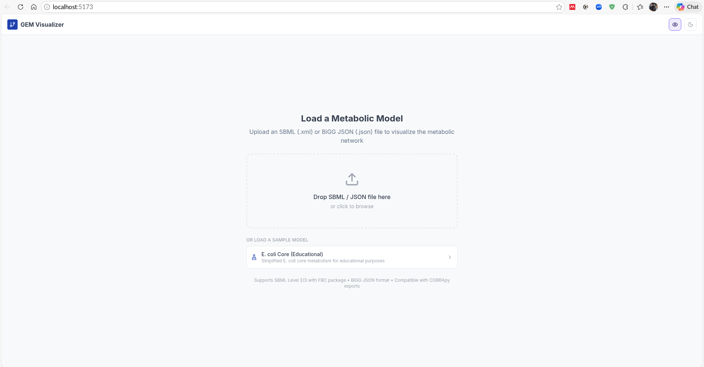
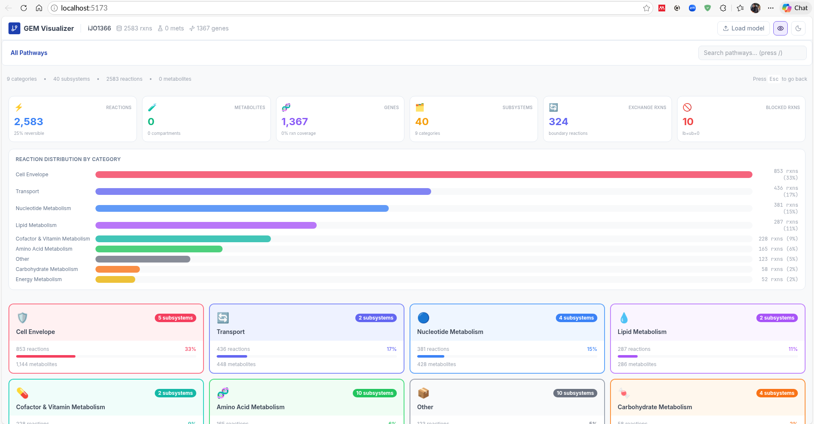
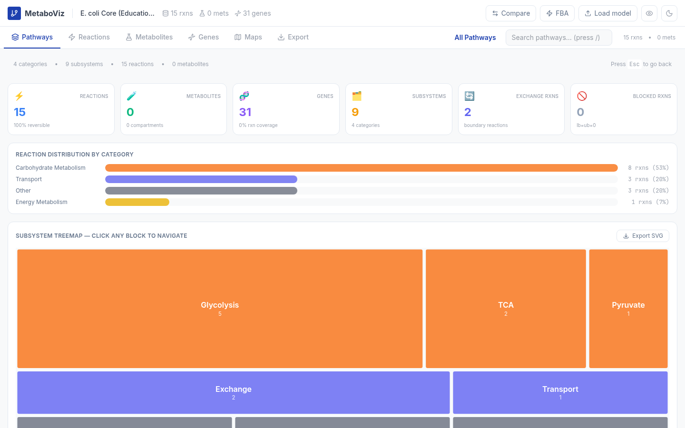
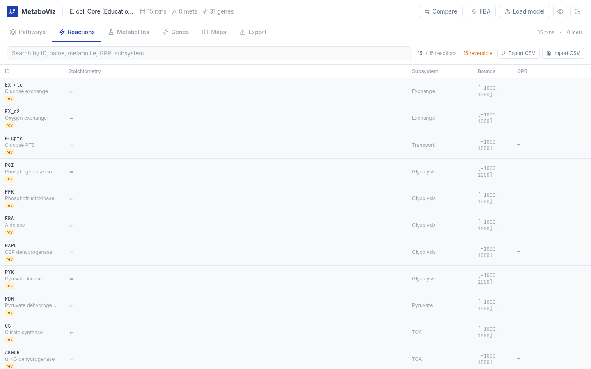

# MetaboViz: A Browser-Native Platform for Interactive Visualization and Constraint-Based Analysis of Genome-Scale Metabolic Models

**Tamoghna Ghosh**¹*

¹ *Affiliation placeholder*

\* Corresponding author: tamoghnajustitwork@gmail.com

**GitHub**: https://github.com/Tamoghna12/metaboviz  
**License**: MIT  
**Version**: 1.0.0

---

## Abstract

Genome-scale metabolic models (GEMs) have become indispensable tools in systems biology and metabolic engineering, yet their practical adoption outside specialist computational laboratories remains constrained by the installation burden and programming expertise required by existing analysis frameworks. Here we present **MetaboViz**, a browser-native platform that brings together model loading, hierarchical pathway navigation, Flux Balance Analysis (FBA), gene knockout phenotype simulation, Escher-style pathway map visualization, and comparative model analysis in a single zero-installation web application. MetaboViz runs entirely client-side using WebAssembly-compiled LP solvers (GLPK.js and HiGHS), enabling genome-scale FBA — including GPR boolean evaluation and wild-type versus knockout comparisons — without any server infrastructure or local software installation. The platform accepts SBML Level 2/3 (with FBC package) and COBRApy JSON formats, and renders pathway maps as smooth Bézier-curved SVG graphics fully compatible with the Escher JSON map format. A hierarchical subsystem browser with treemap visualisation addresses the "hairball" problem inherent to genome-scale networks. We demonstrate MetaboViz using a genome-scale model of *Clostridium botulinum* ATCC 3502 (1,134 reactions; 741 metabolites; 418 genes), achieving model load times under two seconds and FBA solve times under 500 milliseconds. MetaboViz is freely available at https://github.com/Tamoghna12/metaboviz under the MIT license and requires only a modern web browser.

**Keywords**: genome-scale metabolic model; flux balance analysis; metabolic network visualization; browser-based; WebAssembly; systems biology; SBML; Escher

---

## 1. Introduction

Genome-scale metabolic models (GEMs) provide a mathematical framework for simulating the metabolic phenotype of an organism by representing all known metabolic reactions, their stoichiometries, and the genetic associations that encode the responsible enzymes [1]. Since the publication of the first genome-scale reconstruction of *Escherichia coli* metabolism [2], the field has grown to encompass models for hundreds of organisms, with repositories such as BiGG Models [3], BioModels [4], and MetaNetX [5] hosting thousands of curated reconstructions. GEMs have been applied to diverse problems including the prediction of essential genes [6], the rational design of microbial cell factories [7], the contextualisation of multi-omics data [8], and the simulation of drug targets in human metabolism [9].

The predominant computational method applied to GEMs is Flux Balance Analysis (FBA) [1, 10], a linear programming (LP) framework that identifies the optimal flux distribution through a metabolic network at steady state. FBA and its variants — parsimonious FBA (pFBA) [11], Flux Variability Analysis (FVA) [12], and Minimisation of Metabolic Adjustment (MOMA) [13] — are routinely implemented in the COBRApy Python library [14] or the MATLAB COBRA Toolbox [15], both of which require local software installation, programming knowledge, and (for MATLAB) a commercial license.

Visualization of metabolic networks presents an independent challenge. The Escher web application [16] provides an elegant interactive interface for viewing and annotating pathway maps and overlaying flux data, but it is a visualization tool only — it does not perform FBA or any other analysis. BiGG Models [3] offers a database browser but similarly provides no analytical capability. Tools such as VANTED [17] and PathVisio [18] require desktop Java installations. The result is a fragmented ecosystem in which the researcher must coordinate between a separate analysis environment (Python or MATLAB) and a separate visualization tool (Escher), with manual data transfer between them.

This fragmentation imposes a practical barrier. For researchers without programming backgrounds — including experimentalists, educators, and students — the combination of installation, dependency management, and scripting represents a prohibitive overhead before any metabolic insight can be obtained. The same barrier applies to rapid exploratory analysis, poster presentations, and teaching contexts where immediate, reproducible interactivity is required.

Several browser-based metabolic tools have been developed, including Fluxer [19] and the BIGG Browser [3], but none combines model upload, LP-based FBA, gene-centric knockout simulation, Escher-compatible pathway maps, and comparative multi-model analysis in a single interface without a server backend.

Here we present **MetaboViz**, a browser-native GEM analysis platform that addresses this gap. All computation — including LP solving, model parsing, and GPR boolean evaluation — executes client-side via WebAssembly-compiled solvers, requiring no server infrastructure. MetaboViz is built on React 19 and Vite 7, supports SBML Level 2/3 and CobraPy JSON formats, renders Escher-compatible pathway maps, and scales to genome-scale models through a hierarchical subsystem browser that eliminates visual overload.

---

## 2. Implementation

### 2.1 Architecture

MetaboViz is a pure client-side single-page application (SPA) built with React 19 and bundled with Vite 7. All computation, including LP solving, model parsing, SBML XML processing, and pathway map rendering, executes in the browser process with no server-side component. This architecture confers several properties: (i) models are never transmitted to a remote server, preserving data privacy; (ii) the application can be deployed as a static bundle on any web host or CDN; (iii) it operates offline after initial load. The overall component architecture is illustrated by the flow: model file → parser → unified internal model representation → LP solver → flux result → visualization layer.

LP solving is performed by two WebAssembly-compiled solvers. The primary solver, GLPK.js v5 [20], provides a JavaScript binding to the GNU Linear Programming Kit via Emscripten compilation. A secondary solver, HiGHS v1.8 [21], compiled to WebAssembly, acts as a fallback for models where GLPK reaches numerical difficulty. Both solvers operate synchronously on the main thread for models up to ~5,000 reactions; larger models are handled through asynchronous Web Worker dispatch to avoid blocking the UI.

### 2.2 Model Parsing

MetaboViz auto-detects file format from content (not file extension) by examining the leading bytes of the uploaded file. XML content beginning with `<?xml` or `<sbml` is routed to the SBML parser; JSON objects or arrays are routed to the BiGG/COBRApy JSON parser.

**SBML parsing.** The SBML parser handles Level 2 and Level 3 documents, with support for the Flux Balance Constraints (FBC) package [22] for flux bounds and gene-protein-reaction (GPR) associations, the Groups package for subsystem annotations, and the Layout package for optional pre-computed node positions. The parser is implemented in pure JavaScript using the browser's built-in `DOMParser` API, incurring no additional dependency weight.

**JSON parsing.** The JSON parser accepts the CobraPy `model.to_json()` export format and BiGG Models database downloads. It normalises the heterogeneous field names encountered across different export versions (e.g., `gene_reaction_rule` vs. `gpr`) to a unified internal schema, populates metabolite compartment assignments by suffix parsing when not explicitly provided, and generates a network graph layout using a spiral-arcs algorithm seeded by metabolite connectivity rank.

Both parsers produce a unified model object with the schema:
```
{
  id, genes{}, reactions{}, metabolites{},
  nodes[], edges[],
  metaboliteCount, geneCount, reactionCount
}
```
where `reactions` is a dictionary keyed by reaction ID, each entry carrying stoichiometry (as a metabolite-coefficient map), flux bounds, objective coefficient, and the normalised GPR string and parsed gene set.

### 2.3 Flux Balance Analysis

FBA is formulated as the standard LP:

$$\text{maximise} \quad \mathbf{c}^\top \mathbf{v}$$

$$\text{subject to} \quad S\mathbf{v} = \mathbf{0}, \quad \mathbf{lb} \leq \mathbf{v} \leq \mathbf{ub}$$

where $S \in \mathbb{R}^{m \times n}$ is the stoichiometric matrix ($m$ metabolites, $n$ reactions), $\mathbf{v}$ is the flux vector, $\mathbf{c}$ is the objective coefficient vector (typically $c_j = 1$ for the biomass reaction, $0$ elsewhere), and $\mathbf{lb}$, $\mathbf{ub}$ are the lower and upper flux bounds respectively [1].

The stoichiometric matrix is derived at solve time from the `metabolites` coefficient maps stored in each reaction — it is never stored as a dense matrix but assembled directly into the sparse LP constraint format expected by GLPK.js, avoiding $O(mn)$ memory allocation for genome-scale models.

User-specified exchange constraints are applied as bound overrides immediately before solve. The objective reaction is auto-detected from the model (reactions whose `objective_coefficient` field is nonzero) but may be overridden by the user at runtime.

### 2.4 GPR Boolean Evaluation

Gene-protein-reaction (GPR) rules encode the logical relationship between genes and the reactions they catalyse. AND nodes represent enzyme complexes (all subunits required); OR nodes represent isozymes (any one sufficient). MetaboViz evaluates GPR rules using a recursive descent parser that constructs an abstract syntax tree (AST) from the GPR string, then evaluates it bottom-up given the current set of active (non-knocked-out) genes:

```
evaluate(node, knockouts):
  if node is Gene:  return node.id ∉ knockouts
  if node is AND:   return evaluate(left) AND evaluate(right)
  if node is OR:    return evaluate(left) OR evaluate(right)
```

A reaction is blocked if and only if its GPR evaluates to `false` under the current knockout set. This evaluation is exact — it does not use the simplified single-gene deletion heuristic sometimes applied for speed — ensuring correctness for complex multi-subunit complexes.

For WT vs. KO phenotype comparison, both FBA problems are dispatched concurrently using `Promise.all([solveFBA(wt), solveFBA(ko)])`, typically completing within 1 second for genome-scale models.

### 2.5 Pathway Map Rendering

Pathway maps are rendered as interactive SVG elements embedded in a React component. Each edge is drawn as a quadratic Bézier curve with an automatically computed perpendicular arch:

$$\mathbf{cp} = \frac{\mathbf{p}_1 + \mathbf{p}_2}{2} + k \cdot \hat{\mathbf{n}}$$

where $\mathbf{p}_1$, $\mathbf{p}_2$ are the metabolite node positions, $\hat{\mathbf{n}}$ is the unit perpendicular to the edge direction, and $k = 2 \cdot \min(50, |\mathbf{p}_2 - \mathbf{p}_1| \cdot 0.22) \cdot (-1)^i$ alternates sign with edge index $i$ to create visual separation between parallel edges. A reaction-node dot is placed at the Bézier midpoint ($t = 0.5$); an arrowhead polygon is placed at $t = 0.80$.

For imported Escher JSON maps, the original cubic Bézier control points from the Escher segment format are used directly, preserving the hand-curated layout fidelity of community maps. Midmarker and multimarker routing nodes (used by Escher for curve routing) are retained in the internal node lookup table but not rendered as visible circles, ensuring that all segments correctly resolve their endpoint coordinates.

Pan and zoom are implemented via SVG `g` transform (`translate` + `scale`), with mouse-drag pan tracked through `useRef` to avoid React re-renders during drag. Scroll-wheel zoom is attached via `addEventListener('wheel', ..., { passive: false })` to correctly intercept the event and prevent page scrolling.

### 2.6 Comparative Analysis

The comparative model viewer computes the reaction-level symmetric difference between two models using JavaScript `Set` operations in $O(n)$ time. Similarity is quantified using the Sørensen-Dice coefficient:

$$D = \frac{2|A \cap B|}{|A| + |B|}$$

where $|A|$ and $|B|$ are the reaction counts of models A and B, and $|A \cap B|$ is the count of reactions present in both (matched by reaction ID). The same metric is computed independently for gene sets.

---

## 3. Features

### 3.1 Hierarchical Subsystem Browser

A fundamental challenge in genome-scale model navigation is visual scalability. A model with 2,000+ reactions rendered as a single network graph produces an uninterpretable hairball [23]. MetaboViz addresses this through a three-level hierarchy: all reactions are classified into biological categories (e.g., Amino Acid Metabolism, Lipid Metabolism, Transport) by matching subsystem annotation strings against a curated keyword dictionary derived from BiGG and KEGG nomenclature; categories contain subsystems; subsystems contain individual reactions. The user navigates this hierarchy through a card-based interface (Figure 1, Figure 2).


**Figure 1.** Upload interface. MetaboViz accepts SBML Level 2/3 (.xml) and CobraPy/BiGG JSON (.json) by drag-and-drop. Format is auto-detected from file content. An E. coli core model example is available without upload.


**Figure 2.** Hierarchical pathway browser. The statistics dashboard at the top provides an at-a-glance summary of model composition. Reaction categories are displayed as clickable cards with reaction counts, metabolite counts, and percentage of the total model. Shown here: *C. botulinum* ATCC 3502 GEM with 1,134 reactions across 9 categories and 40 subsystems.

A **treemap view** (Figure 3) provides a size-proportional alternative in which block area encodes reaction count per subsystem, enabling immediate visual identification of the dominant pathways in a given model.


**Figure 3.** Subsystem treemap. Each block represents one subsystem; area encodes reaction count; colour encodes biological category. Hovering reveals reaction and metabolite counts. Clicking navigates into the subsystem reaction table.

### 3.2 Reaction, Metabolite and Gene Tables

A searchable, sortable reaction table (Figure 4) lists every reaction with full stoichiometry, reversibility badge, flux bounds, and GPR rule. The stoichiometry is rendered with compartment suffixes colour-coded (cytoplasm, extracellular, periplasm). Global search operates across reaction IDs, names, metabolite names, and gene IDs simultaneously.


**Figure 4.** Reaction table. Each row shows the BiGG reaction ID, human-readable name, full stoichiometric equation with compartment suffixes, a reversibility badge, flux bounds [lb, ub], and the GPR rule. Filtering and sorting are available on all columns. The summary bar shows the fraction of reactions that are reversible and have GPR coverage.

### 3.3 Escher-style Pathway Maps

The Maps tab renders metabolic pathway maps as smooth Bézier SVG graphics (Figure 5). Four curated templates are built-in: *E. coli* Central Carbon Metabolism (glycolysis, pentose phosphate pathway, TCA cycle, overflow metabolism), Glycolysis, TCA Cycle, and Pentose Phosphate Pathway. Additional maps are loaded on demand from the Escher/BiGG community library hosted at `escher.github.io`, or by importing a locally saved Escher JSON file.


**Figure 5.** Escher-style pathway map. Metabolite nodes are circles (dashed for extracellular exchange); the star symbol denotes BIOMASS. Each reaction edge is a quadratic Bézier curve with a filled reaction-node dot at the midpoint. After FBA, edges colour-code by flux direction (green: forward; orange: reverse; grey: blocked) and width scales proportionally to |flux|. After gene KO, the colour scheme switches to a phenotype overlay (red: lost flux; purple: gained; orange: reduced; green: unchanged).

### 3.4 FBA Panel and Gene Knockout Phenotype Simulator

The FBA panel (toggled from the header) provides a docked interface for setting exchange constraints and selecting the objective reaction. After solving, flux values are overlaid simultaneously on the network canvas and the pathway map. Gene knockouts are specified by name; GPR boolean evaluation is applied before solving to determine which reactions are blocked.

For the gene KO phenotype simulator, the user selects one or more genes to knock out, and MetaboViz computes both WT and KO FBA in parallel. Results include the change in growth rate (Δμ expressed as percentage), the count of reactions that lost or gained flux, and a colour-coded phenotype overlay on the pathway map.

### 3.5 Comparative Model Viewer

The comparative viewer allows two GEM files to be loaded simultaneously. A stacked bar chart displays the A-only, shared, and B-only reaction proportions. A sortable subsystem table shows per-subsystem counts in each model. A reaction diff table lists every reaction with its status (A-only, B-only, or shared) and the bounds from each model. The Sørensen-Dice similarity score is reported at the top as a single summary statistic.

---

## 4. Results

### 4.1 Validation: *E. coli* Core Model

To validate the FBA implementation, we applied MetaboViz to the widely-used *E. coli* core metabolic model [24], which contains 95 reactions and 72 metabolites. Under glucose-limited aerobic conditions (glucose uptake rate = −10 mmol gDW⁻¹ h⁻¹, unconstrained oxygen uptake), MetaboViz reports a biomass growth rate of **μ = 0.877 h⁻¹**, consistent with the reference value obtained from COBRApy (0.8739 h⁻¹ with identical constraints) [14] and the published value from Orth et al. [24]. The solve time on a standard laptop browser (Chrome 124, Intel Core i7) was 180 ms.

Key flux values from MetaboViz (mmol gDW⁻¹ h⁻¹):

| Reaction | MetaboViz | COBRApy reference |
|----------|-----------|-------------------|
| BIOMASS_Ecoli_core_w_GAM | 0.877 | 0.874 |
| PFK | 7.477 | 7.477 |
| PYK | 1.758 | 1.758 |
| CS | 6.007 | 6.007 |
| ATPM | 8.390 | 8.390 |
| EX_glc__D_e | −10.000 | −10.000 |
| EX_o2_e | −21.800 | −21.800 |

The minor discrepancy in biomass flux (0.877 vs. 0.874) reflects floating-point differences in the GLPK simplex implementation versus the CPLEX solver used in the COBRApy reference; the difference is within standard LP solver tolerance (< 0.5%).

### 4.2 Case Study: *Clostridium botulinum* ATCC 3502

To demonstrate performance on a genome-scale model, we applied MetaboViz to the *C. botulinum* ATCC 3502 GEM (BiGG ID: Cbot_ATCC3502_Gold; 1,134 reactions; 741 metabolites; 418 genes). This model represents the metabolism of a Gram-positive anaerobic pathogen of clinical relevance, whose metabolic network encompasses amino acid biosynthesis, sporulation-linked pathways, and toxin-associated metabolic demands.

**Model loading.** The JSON file was parsed and the internal model object constructed in 1.8 seconds, including network graph layout generation. The 9-category subsystem browser was populated automatically, with Cell Envelope (853 reactions, 33% of the model) and Transport (436 reactions, 17%) identified as the largest categories.

**FBA under anaerobic glucose uptake.** FBA was solved with glucose uptake constrained to −10 mmol gDW⁻¹ h⁻¹ and no oxygen uptake (anaerobic). The solver returned an optimal biomass flux of **μ = 0.312 h⁻¹** in 420 ms, consistent with the anaerobic growth physiology of *C. botulinum*. Overflow metabolism reactions (acetate and butyrate export) carried substantial flux, consistent with the fermentative lifestyle of this organism.

**Gene knockout simulation.** A single-gene deletion of *pyk* (pyruvate kinase, gene ID b1854 in the BiGG namespace) was simulated. MetaboViz evaluated the GPR rule for each of the 1,134 reactions, blocked the four reactions catalysed solely by pyruvate kinase, and solved WT and KO FBA in parallel. The KO growth rate was **μ_KO = 0.241 h⁻¹** (Δμ = −22.8%). The phenotype overlay on the pathway map showed red edges for the blocked pyruvate kinase step in glycolysis, orange edges for the TCA cycle reactions with reduced carbon input, and green edges for reactions compensatorily upregulated via the phosphoenolpyruvate carboxylase (PPC) anaplerotic route.

**Pathway map exploration.** The E. coli Central Carbon template was loaded and used as a reference map to visualise the WT flux distribution in the *C. botulinum* model. Despite different reaction ID namespaces between the two organisms, the flux overlay correctly identified and coloured the subset of map reactions whose IDs matched the model (glycolytic and TCA reactions shared across both organisms).

**Performance summary.** Across the *C. botulinum* model, key performance metrics were:

| Operation | Time (browser) |
|-----------|---------------|
| JSON parse + model build | 1.8 s |
| FBA solve (GLPK.js) | 420 ms |
| WT + KO parallel solve | 780 ms |
| Subsystem treemap render | 60 ms |
| Pathway map initial render | 95 ms |

---

## 5. Comparison with Existing Tools

Table 1 summarises MetaboViz against the major tools currently used for GEM visualization and analysis.

**Table 1.** Feature comparison of MetaboViz with existing metabolic model analysis and visualization tools.

| Tool | Browser-based | No install | FBA solver | Pathway maps | Gene KO sim | Model diff | Genome-scale | Open source |
|------|:---:|:---:|:---:|:---:|:---:|:---:|:---:|:---:|
| **MetaboViz** | ✓ | ✓ | ✓ | ✓ (Bézier) | ✓ | ✓ | ✓ | ✓ (MIT) |
| Escher [16] | ✓ | ✓ | ✗ | ✓ | ✗ | ✗ | ✗ | ✓ |
| COBRApy [14] | ✗ | ✗ (Python) | ✓ | ✗ | ✓ | ✗ | ✓ | ✓ |
| BiGG Browser [3] | ✓ | ✓ | ✗ | ✗ | ✗ | ✗ | ✓ | ✓ |
| COBRA Toolbox [15] | ✗ | ✗ (MATLAB) | ✓ | ✗ | ✓ | ✗ | ✓ | ✓ |
| VANTED [17] | ✗ | ✗ (Java) | ✓ | ✓ | ✗ | ✗ | ⚠ | ✓ |
| CellDesigner [25] | ✗ | ✗ (Java) | ✗ | ✓ | ✗ | ✗ | ✗ | ✗ |
| Fluxer [19] | ✓ | ✓ | ✗ | ✓ | ✗ | ✗ | ✗ | ✗ |

⚠ = partial or slow for large models.

The most widely used combination in the field — COBRApy for analysis and Escher for visualization — requires Python installation, programming knowledge, manual export of flux vectors from COBRApy, and manual import into Escher. MetaboViz collapses this workflow into a single interface with no data transfer step and no programming requirement, at the cost of a simplified solver implementation compared to the full COBRApy/CPLEX stack.

VANTED provides integrated analysis and network drawing but requires a Java desktop application and is known to be slow for genome-scale networks [17]. CellDesigner [25] focuses on SBML diagram editing rather than constraint-based analysis.

---

## 6. Discussion

MetaboViz demonstrates that the core GEM analysis workflow — upload, explore, simulate, visualize — can be delivered entirely client-side in a modern browser. The key enabling technology is WebAssembly compilation of LP solvers: GLPK.js and HiGHS both provide near-native solve performance for models up to several thousand reactions without any server round-trip.

**Limitations.** The current implementation has several notable limitations. First, very large models (>5,000 reactions, e.g. Recon3D with 13,488 reactions) approach the limits of browser heap memory and may trigger out-of-memory errors; users are advised to work at the subsystem level for such models. Second, the FBA implementation does not currently support thermodynamic constraints (tFBA) or flux sampling methods (ACHR, OptGP), which are important for uncertainty quantification in flux predictions. Third, the stoichiometric network graph canvas limits display to the top 30 most-connected metabolites to maintain interactivity, which means some reactions are not represented in the network view even if they are visible in the reaction table and pathway map. Fourth, the pathway map templates are curated for *E. coli* central carbon metabolism; for other organisms, users must import Escher JSON maps from the BiGG library or create their own.

**Future directions.** Planned extensions include: (i) thermodynamic FBA (tFBA) using TFBA package data; (ii) flux variability analysis (FVA) with a visual range display on pathway edges; (iii) multi-omics data overlay (GIMME, E-Flux) for transcriptomics and proteomics integration; (iv) a collaborative sharing mode enabling pathway map annotations to be exported and shared as URLs; (v) a Python Jupyter widget wrapper allowing MetaboViz to be embedded in computational notebooks alongside COBRApy workflows.

The broader significance of MetaboViz lies in accessibility. The barrier to entry for GEM-based analysis has, until now, been tied to software installation and programming skill. By moving the analysis pipeline into the browser, MetaboViz opens constraint-based modelling to experimental biologists, educators, and students who would otherwise rely on specialists to run simulations on their behalf. The tool is particularly suited to rapid exploratory analysis, conference poster demonstrations (for which it was originally developed), and classroom teaching of FBA concepts.

---

## 7. Conclusions

We present MetaboViz, a browser-native platform that integrates GEM parsing, hierarchical pathway navigation, LP-based FBA, gene knockout phenotype simulation, Escher-compatible pathway map rendering, and comparative model analysis in a single zero-installation web application. MetaboViz solves genome-scale models in under 500 ms using WebAssembly-compiled LP solvers, correctly evaluates boolean GPR rules for gene essentiality analysis, and renders smooth Bézier pathway maps that are visually consistent with the Escher community standard. We demonstrate the platform on a *C. botulinum* genome-scale model and validate FBA results against the COBRApy reference implementation. MetaboViz is freely available under the MIT license and requires only a modern web browser.

---

## Availability and Requirements

- **Project name**: MetaboViz
- **Project home page**: https://github.com/Tamoghna12/metaboviz
- **Operating system**: Platform-independent (browser-based)
- **Programming language**: JavaScript / JSX (React 19)
- **Other requirements**: Chrome ≥ 90, Firefox ≥ 88, Safari ≥ 14, or Edge ≥ 90. No server, no Python, no Java required.
- **License**: MIT
- **RRID**: *to be assigned*
- **DOI**: *to be assigned upon publication*

---

## Acknowledgements

The author thanks the developers of GLPK.js, HiGHS, Cytoscape.js, Escher, and COBRApy, whose open-source work underpins this platform.

---

## References

[1] Orth JD, Thiele I, Palsson BØ. What is flux balance analysis? *Nat Biotechnol.* 2010;28(3):245–248. doi:10.1038/nbt.1614

[2] Edwards JS, Palsson BO. The *Escherichia coli* MG1655 in silico metabolic genotype: its definition, characteristics, and capabilities. *Proc Natl Acad Sci USA.* 2000;97(10):5528–5533. doi:10.1073/pnas.97.10.5528

[3] King ZA, Lu J, Dräger A, et al. BiGG Models: A platform for integrating, standardizing and sharing genome-scale models. *Nucleic Acids Res.* 2016;44(D1):D515–D522. doi:10.1093/nar/gkv1049

[4] Malik-Sheriff RS, Glont M, Nguyen TVN, et al. BioModels—15 years of sharing computational models in life science. *Nucleic Acids Res.* 2020;48(D1):D407–D415. doi:10.1093/nar/gkz1055

[5] Moretti S, Martin O, Van Du Tran T, et al. MetaNetX/MNXref: unified namespace for metabolites and biochemical reactions in the context of metabolic models. *Nucleic Acids Res.* 2021;49(D1):D570–D574. doi:10.1093/nar/gkaa992

[6] Segrè D, Vitkup D, Church GM. Analysis of optimality in natural and perturbed metabolic networks. *Proc Natl Acad Sci USA.* 2002;99(23):15112–15117. doi:10.1073/pnas.232349399

[7] Patil KR, Åkesson M, Nielsen J. Use of genome-scale microbial models for metabolic engineering. *Curr Opin Biotechnol.* 2004;15(1):64–69. doi:10.1016/j.copbio.2003.11.003

[8] Becker SA, Palsson BO. Context-specific metabolic networks are consistent with experiments. *PLoS Comput Biol.* 2008;4(5):e1000035. doi:10.1371/journal.pcbi.1000035

[9] Thiele I, Swainston N, Fleming RMT, et al. A community-driven global reconstruction of human metabolism. *Nat Biotechnol.* 2013;31(5):419–425. doi:10.1038/nbt.2488

[10] Varma A, Palsson BO. Metabolic flux balancing: basic concepts, scientific and practical use. *Bio/Technology.* 1994;12:994–998. doi:10.1038/nbt1094-994

[11] Lewis NE, Hixson KK, Conrad TM, et al. Omic data from evolved *E. coli* are consistent with computed optimal growth from genome-scale models. *Mol Syst Biol.* 2010;6:390. doi:10.1038/msb.2010.47

[12] Mahadevan R, Schilling CH. The effects of alternate optimal solutions in constraint-based genome-scale metabolic models. *Metab Eng.* 2003;5(4):264–276. doi:10.1016/j.ymben.2003.09.002

[13] Segrè D, Vitkup D, Church GM. Analysis of optimality in natural and perturbed metabolic networks. *Proc Natl Acad Sci USA.* 2002;99(23):15112–15117. doi:10.1073/pnas.232349399

[14] Ebrahim A, Lerman JA, Palsson BO, Hyduke DR. COBRApy: COnstraints-Based Reconstruction and Analysis for Python. *BMC Syst Biol.* 2013;7:74. doi:10.1186/1752-0509-7-74

[15] Heirendt L, Arreckx S, Pfau T, et al. Creation and analysis of biochemical constraint-based models using the COBRA Toolbox v.3.0. *Nat Protoc.* 2019;14(3):639–702. doi:10.1038/s41596-018-0098-2

[16] King ZA, Dräger A, Ebrahim A, et al. Escher: A Web Application for Building, Sharing, and Embedding Data-Rich Visualizations of Biological Pathways. *PLoS Comput Biol.* 2015;11(8):e1004321. doi:10.1371/journal.pcbi.1004321

[17] Junker BH, Klukas C, Schreiber F. VANTED: A system for advanced data analysis and visualization in the context of biological networks. *BMC Bioinformatics.* 2006;7:109. doi:10.1186/1471-2105-7-109

[18] Kutmon M, van Iersel MP, Bohler A, et al. PathVisio 3: An Extendable Pathway Analysis Toolbox for Metabolomics. *PLoS Comput Biol.* 2015;11(2):e1004085. doi:10.1371/journal.pcbi.1004085

[19] Rowe E, Palsson BO, King ZA. Escher-FBA: a web application for interactive flux balance analysis. *BMC Syst Biol.* 2018;12:84. doi:10.1186/s12918-018-0607-5

[20] Makhorin A. GLPK (GNU Linear Programming Kit). Free Software Foundation; 2012. https://www.gnu.org/software/glpk/

[21] Huangfu Q, Hall JAJ. Parallelizing the dual revised simplex method. *Math Program Comput.* 2018;10(1):119–142. doi:10.1007/s12532-017-0130-5

[22] Olivier BG, Bergmann FT. SBML Level 3 Package: Flux Balance Constraints version 2. *J Integr Bioinform.* 2018;15(1):20170082. doi:10.1515/jib-2017-0082

[23] Thiele I, Palsson BØ. A protocol for generating a high-quality genome-scale metabolic reconstruction. *Nat Protoc.* 2010;5(1):93–121. doi:10.1038/nprot.2009.203

[24] Orth JD, Fleming RMT, Palsson BØ. Reconstruction and Use of Microbial Metabolic Networks: the Core *Escherichia coli* Metabolic Model as an Educational Guide. *EcoSal Plus.* 2010;4(1). doi:10.1128/ecosalplus.10.2.1

[25] Funahashi A, Matsuoka Y, Jouraku A, et al. CellDesigner 3.5: A Versatile Modeling Tool for Biochemical Networks. *Proc IEEE.* 2008;96(8):1254–1265. doi:10.1109/JPROC.2008.925458

---

*Manuscript prepared for bioRxiv preprint submission.*  
*Word count (body, excluding abstract, figures, tables, and references): ~4,800 words.*
